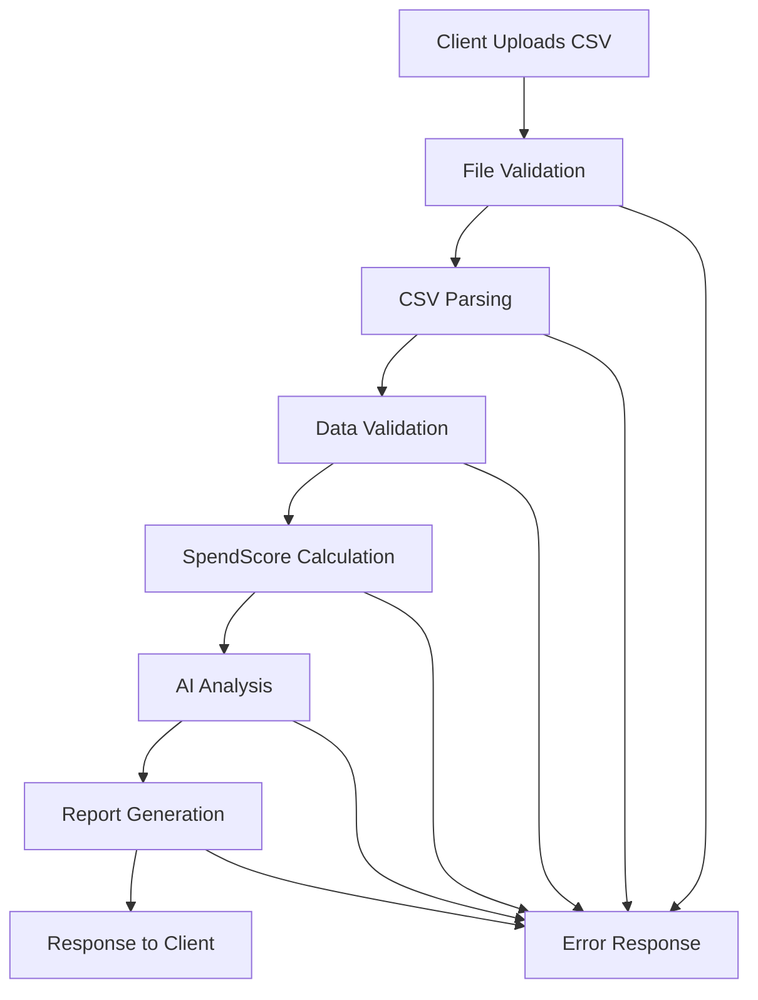
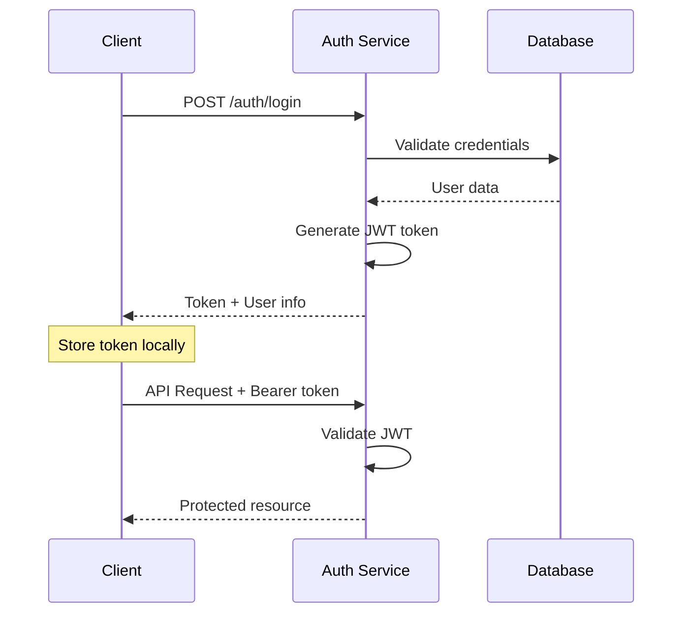
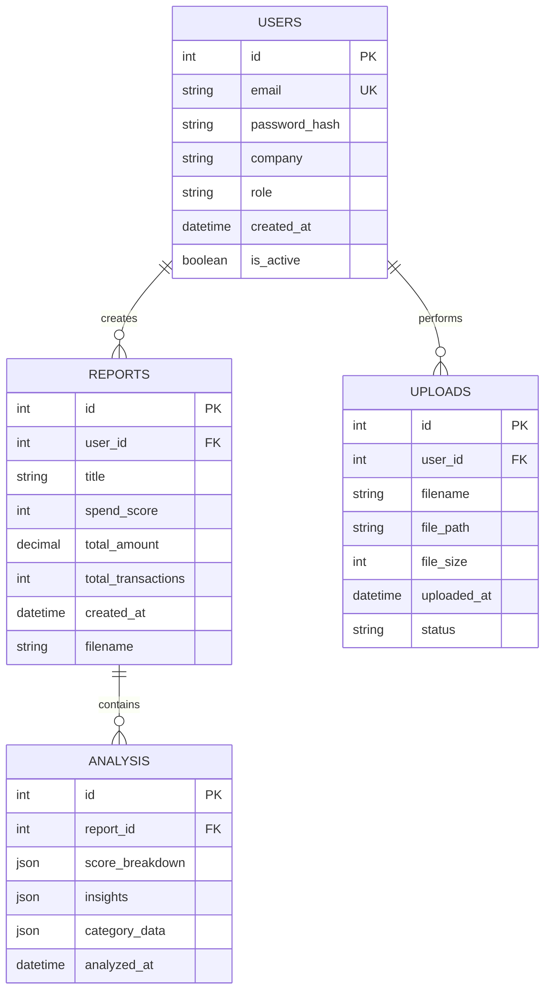

# 🏗️ VeroctaAI System Architecture Documentation

This document provides a comprehensive overview of the VeroctaAI system architecture, design decisions, and technical implementation details.

## 📋 Table of Contents

1. [System Overview](#system-overview)
2. [Architecture Patterns](#architecture-patterns)
3. [Core Components](#core-components)
4. [Data Flow](#data-flow)
5. [Security Architecture](#security-architecture)
6. [Performance Considerations](#performance-considerations)
7. [Scalability Design](#scalability-design)
8. [Technology Stack](#technology-stack)
9. [API Design](#api-design)
10. [Database Design](#database-design)

## 🎯 System Overview

VeroctaAI is a cloud-native, microservices-oriented financial intelligence platform designed to analyze business expenses and provide AI-powered insights for cost optimization.

### Core Objectives
- **Financial Analysis**: Advanced SpendScore calculation with 6 weighted metrics
- **AI Integration**: GPT-4o powered insights and recommendations
- **Multi-format Support**: Handle various CSV formats from different accounting systems
- **Scalable Architecture**: Designed for horizontal scaling and high availability
- **Security First**: JWT authentication, data encryption, and secure file handling

## 🏛️ Architecture Patterns

### 1. Layered Architecture
```
┌─────────────────────────────────────┐
│           Presentation Layer         │
│        (API Endpoints/Routes)       │
├─────────────────────────────────────┤
│           Business Logic Layer      │
│    (SpendScore Engine, Analysis)   │
├─────────────────────────────────────┤
│           Data Access Layer          │
│      (Database, File Storage)        │
├─────────────────────────────────────┤
│           External Services          │
│    (OpenAI API, Supabase, etc.)     │
└─────────────────────────────────────┘
```

### 2. Microservices-Ready Design
- **Stateless Services**: No server-side session storage
- **API-First**: RESTful API design for service communication
- **Container Ready**: Docker support for containerized deployment
- **Database Agnostic**: Support for multiple database backends

### 3. Event-Driven Architecture
- **Asynchronous Processing**: Non-blocking file uploads and analysis
- **Webhook Support**: Real-time notifications (planned)
- **Queue Integration**: Background job processing (planned)

## 🔧 Core Components

### 1. Application Core (`app.py`)

**Responsibilities**:
- Flask application initialization
- Middleware configuration (CORS, JWT, logging)
- Environment variable management
- Error handling and logging setup

**Key Features**:
```python
# Environment-based configuration
FLASK_ENV = os.environ.get('FLASK_ENV', 'development')
SESSION_SECRET = os.environ.get('SESSION_SECRET') or generate_fallback_secret()

# CORS configuration for cross-origin requests
CORS(app, resources={
    r"/api/*": {
        "origins": allowed_origins,
        "methods": ["GET", "POST", "PUT", "DELETE", "OPTIONS"],
        "allow_headers": ["Content-Type", "Authorization", "Accept"]
    }
})
```

### 2. Authentication System (`auth.py`)

**Architecture Pattern**: JWT-based stateless authentication

**Components**:
- **Token Management**: JWT creation, validation, and refresh
- **User Management**: Registration, login, profile management
- **Role-Based Access**: Admin and user permission levels
- **Password Security**: bcrypt hashing with salt

**Security Features**:
```python
# Password hashing with bcrypt
def hash_password(password: str) -> str:
    salt = bcrypt.gensalt()
    return bcrypt.hashpw(password.encode('utf-8'), salt).decode('utf-8')

# JWT token creation with expiration
def create_access_token(user_data: dict) -> str:
    expires = timedelta(hours=24)
    return create_access_token(
        identity=user_data['email'],
        expires_delta=expires,
        additional_claims={'role': user_data['role']}
    )
```

### 3. SpendScore Engine (`spend_score_engine.py`)

**Algorithm Design**: Weighted scoring system with 6 metrics

**Metrics and Weights**:
```python
WEIGHTS = {
    'frequency_score': 15,      # Transaction frequency patterns
    'category_diversity': 10,   # Number of spending categories
    'budget_adherence': 20,     # Spending vs. benchmarks
    'redundancy_detection': 15, # Duplicate/redundant expenses
    'spike_detection': 20,      # Unusual spending patterns
    'waste_ratio': 20          # Essential vs. non-essential spending
}
```

**Traffic Light System**:
- **Green (90-100)**: Excellent financial management
- **Amber (70-89)**: Good with room for improvement
- **Red (0-69)**: Needs significant optimization

### 4. AI Integration (`gpt_utils.py`)

**Integration Pattern**: RESTful API calls to OpenAI GPT-4o

**Features**:
- **Prompt Engineering**: Structured prompts for financial analysis
- **Response Parsing**: JSON-formatted insights extraction
- **Error Handling**: Graceful fallback when AI service unavailable
- **Rate Limiting**: Built-in request throttling

**Prompt Structure**:
```python
def load_prompt_template():
    return """
    You are a financial advisor analyzing business expense data.
    Generate exactly 3 actionable suggestions to reduce unnecessary expenses.
    
    Return JSON format:
    {
        "suggestions": [
            {"priority": "High", "text": "Specific actionable suggestion"},
            {"priority": "Medium", "text": "Specific actionable suggestion"},
            {"priority": "Low", "text": "Specific actionable suggestion"}
        ]
    }
    """
```

### 5. File Processing (`csv_parser.py`)

**Design Pattern**: Strategy pattern for different CSV formats

**Supported Formats**:
- QuickBooks CSV
- Wave Accounting CSV
- Revolut Business CSV
- Xero CSV
- Generic CSV (auto-detection)

**Processing Pipeline**:
```python
def parse_csv_file(filepath: str) -> List[Dict]:
    # 1. Detect CSV format
    format_type = detect_csv_format(filepath)
    
    # 2. Apply appropriate parser
    parser = get_parser(format_type)
    
    # 3. Validate and clean data
    transactions = parser.parse(filepath)
    validated_transactions = validate_transactions(transactions)
    
    # 4. Return structured data
    return validated_transactions
```

### 6. Report Generation (`pdf_generator.py`)

**Architecture**: Template-based PDF generation

**Features**:
- **Dynamic Content**: Company branding and custom data
- **Chart Generation**: Visual representation of spending patterns
- **Multi-page Support**: Detailed breakdowns and summaries
- **Caching**: Generated reports cached for performance

## 🔄 Data Flow

### 1. File Upload and Analysis Flow



### 2. Authentication Flow



### 3. Analysis Processing Flow


## 🔒 Security Architecture

### 1. Authentication & Authorization

**JWT Implementation**:
```python
# Token structure
{
    "sub": "user@example.com",
    "iat": 1640995200,
    "exp": 1641081600,
    "role": "user",
    "company": "Example Corp"
}
```

**Security Measures**:
- **Token Expiration**: 24-hour token lifetime
- **Secure Headers**: Authorization header validation
- **Role-Based Access**: Admin and user permission levels
- **Password Hashing**: bcrypt with salt

### 2. Data Protection

**File Security**:
- **Upload Validation**: File type and size restrictions
- **Temporary Storage**: Files deleted after processing
- **Path Traversal Protection**: Secure filename handling

**Data Encryption**:
- **In Transit**: HTTPS/TLS encryption
- **At Rest**: Database encryption (Supabase)
- **Sensitive Data**: Password hashing, token encryption

### 3. Input Validation

**CSV Validation**:
```python
def validate_transactions(transactions: List[Dict]) -> List[Dict]:
    validated = []
    for transaction in transactions:
        # Validate required fields
        if not all(key in transaction for key in ['date', 'amount', 'description']):
            continue
            
        # Validate data types
        try:
            transaction['amount'] = float(transaction['amount'])
            transaction['date'] = parse_date(transaction['date'])
        except (ValueError, TypeError):
            continue
            
        validated.append(transaction)
    
    return validated
```

## ⚡ Performance Considerations

### 1. Caching Strategy

**Multi-Level Caching**:
- **Application Cache**: In-memory caching for frequent data
- **Database Cache**: Query result caching
- **CDN Cache**: Static asset caching (planned)

**Cache Implementation**:
```python
from functools import lru_cache

@lru_cache(maxsize=128)
def get_spend_score_cached(transaction_hash: str) -> Dict:
    # Expensive calculation cached
    return calculate_spend_score(transactions)
```

### 2. Database Optimization

**Connection Pooling**:
```python
# Supabase connection with pooling
DATABASE_CONFIG = {
    'pool_size': 10,
    'max_overflow': 20,
    'pool_timeout': 30,
    'pool_recycle': 3600
}
```

**Query Optimization**:
- **Indexed Fields**: User ID, report ID, timestamps
- **Batch Operations**: Bulk insert/update operations
- **Lazy Loading**: Load data on demand

### 3. File Processing Optimization

**Streaming Processing**:
```python
def process_large_csv(filepath: str) -> Iterator[Dict]:
    """Process large CSV files in chunks"""
    chunk_size = 1000
    with open(filepath, 'r') as file:
        reader = csv.DictReader(file)
        chunk = []
        
        for row in reader:
            chunk.append(row)
            if len(chunk) >= chunk_size:
                yield process_chunk(chunk)
                chunk = []
        
        if chunk:
            yield process_chunk(chunk)
```

## 📈 Scalability Design

### 1. Horizontal Scaling

**Stateless Design**:
- No server-side session storage
- JWT tokens for authentication
- Database-backed user management

**Load Balancing**:
```yaml
# Docker Compose with load balancer
services:
  nginx:
    image: nginx:alpine
    ports:
      - "80:80"
    volumes:
      - ./nginx.conf:/etc/nginx/nginx.conf
  
  api-1:
    build: .
    environment:
      - INSTANCE_ID=1
  
  api-2:
    build: .
    environment:
      - INSTANCE_ID=2
```

### 2. Microservices Architecture

**Service Decomposition**:
- **Auth Service**: User management and authentication
- **Analysis Service**: SpendScore calculation and AI integration
- **File Service**: CSV processing and validation
- **Report Service**: PDF generation and storage

**Service Communication**:
```python
# Service-to-service communication
class ServiceClient:
    def __init__(self, service_url: str, auth_token: str):
        self.client = httpx.AsyncClient(
            base_url=service_url,
            headers={'Authorization': f'Bearer {auth_token}'}
        )
    
    async def call_service(self, endpoint: str, data: dict):
        response = await self.client.post(endpoint, json=data)
        return response.json()
```

### 3. Database Scaling

**Read Replicas**:
- **Master Database**: Write operations
- **Read Replicas**: Read operations and analytics
- **Connection Routing**: Automatic read/write splitting

**Sharding Strategy**:
- **User-Based Sharding**: Partition by user ID
- **Time-Based Sharding**: Partition by date ranges
- **Geographic Sharding**: Partition by region (planned)

## 🛠️ Technology Stack

### Backend Technologies

| Component | Technology | Version | Purpose |
|-----------|------------|---------|---------|
| **Runtime** | Python | 3.13+ | Application runtime |
| **Framework** | Flask | 2.3+ | Web framework |
| **WSGI Server** | Gunicorn | 20.1+ | Production server |
| **Authentication** | Flask-JWT-Extended | 4.5+ | JWT token management |
| **Database** | Supabase/PostgreSQL | Latest | Primary database |
| **AI Integration** | OpenAI API | Latest | GPT-4o integration |
| **File Processing** | pandas | 2.0+ | CSV processing |
| **PDF Generation** | ReportLab | 4.0+ | Report generation |

### Development Tools

| Tool | Purpose |
|------|---------|
| **Docker** | Containerization |
| **Git** | Version control |
| **pytest** | Testing framework |
| **Black** | Code formatting |
| **Flake8** | Linting |
| **mypy** | Type checking |

### Deployment Platforms

| Platform | Use Case | Configuration |
|----------|----------|---------------|
| **Render.com** | Primary deployment | `render.yaml` |
| **Heroku** | Alternative deployment | `Procfile` |
| **Docker** | Container deployment | `Dockerfile` |
| **AWS** | Enterprise deployment | CloudFormation |

## 🔌 API Design

### RESTful Principles

**Resource-Based URLs**:
```
GET    /api/reports          # List reports
POST   /api/reports          # Create report
GET    /api/reports/{id}     # Get specific report
PUT    /api/reports/{id}     # Update report
DELETE /api/reports/{id}     # Delete report
```

**HTTP Status Codes**:
- `200 OK`: Successful GET, PUT
- `201 Created`: Successful POST
- `204 No Content`: Successful DELETE
- `400 Bad Request`: Invalid request data
- `401 Unauthorized`: Authentication required
- `403 Forbidden`: Insufficient permissions
- `404 Not Found`: Resource not found
- `500 Internal Server Error`: Server error

### API Versioning

**URL Versioning**:
```
/api/v1/upload
/api/v2/upload
```

**Header Versioning**:
```http
Accept: application/vnd.verocta.v2+json
```

### Response Format

**Standard Response Structure**:
```json
{
  "success": true,
  "data": {
    // Response data
  },
  "meta": {
    "timestamp": "2024-01-15T10:30:00Z",
    "version": "2.0.0",
    "request_id": "req_123456"
  }
}
```

**Error Response Structure**:
```json
{
  "success": false,
  "error": {
    "code": "VALIDATION_ERROR",
    "message": "Invalid file format",
    "details": "Only CSV files are supported"
  },
  "meta": {
    "timestamp": "2024-01-15T10:30:00Z",
    "version": "2.0.0",
    "request_id": "req_123456"
  }
}
```

## 🗄️ Database Design

### Entity Relationship Diagram



### Database Schema

**Users Table**:
```sql
CREATE TABLE users (
    id SERIAL PRIMARY KEY,
    email VARCHAR(255) UNIQUE NOT NULL,
    password_hash VARCHAR(255) NOT NULL,
    company VARCHAR(255),
    role VARCHAR(50) DEFAULT 'user',
    created_at TIMESTAMP DEFAULT CURRENT_TIMESTAMP,
    is_active BOOLEAN DEFAULT TRUE
);

CREATE INDEX idx_users_email ON users(email);
CREATE INDEX idx_users_company ON users(company);
```

**Reports Table**:
```sql
CREATE TABLE reports (
    id SERIAL PRIMARY KEY,
    user_id INTEGER REFERENCES users(id),
    title VARCHAR(255),
    spend_score INTEGER,
    total_amount DECIMAL(15,2),
    total_transactions INTEGER,
    created_at TIMESTAMP DEFAULT CURRENT_TIMESTAMP,
    filename VARCHAR(255)
);

CREATE INDEX idx_reports_user_id ON reports(user_id);
CREATE INDEX idx_reports_created_at ON reports(created_at);
```

### Data Migration Strategy

**Version Control**:
```python
# Migration system
class Migration:
    def __init__(self, version: str, description: str):
        self.version = version
        self.description = description
    
    def up(self):
        """Apply migration"""
        pass
    
    def down(self):
        """Rollback migration"""
        pass
```

## 🔮 Future Architecture Considerations

### 1. Event-Driven Architecture

**Message Queue Integration**:
```python
# Redis/RabbitMQ integration
class EventPublisher:
    def __init__(self, redis_client):
        self.redis = redis_client
    
    async def publish_analysis_complete(self, user_id: int, report_id: int):
        event = {
            'type': 'analysis.completed',
            'user_id': user_id,
            'report_id': report_id,
            'timestamp': datetime.utcnow().isoformat()
        }
        await self.redis.publish('events', json.dumps(event))
```

### 2. GraphQL API

**Schema Definition**:
```graphql
type Query {
  reports(userId: ID!): [Report]
  analysis(reportId: ID!): Analysis
  spendScore(transactions: [TransactionInput!]!): SpendScore
}

type Mutation {
  uploadFile(file: Upload!, mapping: JSON): UploadResult
  createReport(title: String!): Report
}

type Report {
  id: ID!
  title: String!
  spendScore: Int!
  totalAmount: Float!
  createdAt: DateTime!
  analysis: Analysis
}
```

### 3. Real-Time Features

**WebSocket Integration**:
```python
# Socket.IO for real-time updates
from flask_socketio import SocketIO, emit

@socketio.on('join_analysis')
def handle_join_analysis(data):
    room = f"analysis_{data['report_id']}"
    join_room(room)
    emit('status', {'message': 'Connected to analysis updates'})

@socketio.on('analysis_progress')
def handle_analysis_progress(data):
    room = f"analysis_{data['report_id']}"
    emit('progress', data, room=room)
```

## 📊 Monitoring and Observability

### 1. Application Metrics

**Key Performance Indicators**:
- **Response Time**: API endpoint latency
- **Throughput**: Requests per second
- **Error Rate**: Failed requests percentage
- **SpendScore Calculation Time**: Analysis performance

**Metrics Collection**:
```python
import time
from functools import wraps

def track_performance(func):
    @wraps(func)
    def wrapper(*args, **kwargs):
        start_time = time.time()
        result = func(*args, **kwargs)
        duration = time.time() - start_time
        
        # Send to metrics service
        metrics_client.timing(f"api.{func.__name__}", duration)
        return result
    return wrapper
```

### 2. Health Checks

**Comprehensive Health Monitoring**:
```python
@app.route('/api/health')
def health_check():
    health_status = {
        'status': 'healthy',
        'timestamp': datetime.utcnow().isoformat(),
        'version': '2.0.0',
        'services': {
            'database': check_database_health(),
            'openai': check_openai_health(),
            'storage': check_storage_health()
        }
    }
    
    # Return appropriate status code
    status_code = 200 if all(health_status['services'].values()) else 503
    return jsonify(health_status), status_code
```

### 3. Logging Strategy

**Structured Logging**:
```python
import structlog

logger = structlog.get_logger()

# Usage
logger.info(
    "file_uploaded",
    user_id=user.id,
    filename=file.filename,
    file_size=file.size,
    processing_time=duration
)
```

## 🆘 Disaster Recovery

### 1. Backup Strategy

**Database Backups**:
- **Daily Backups**: Automated daily database snapshots
- **Point-in-Time Recovery**: Transaction log backups
- **Cross-Region Replication**: Multi-region backup storage

**File Backups**:
- **Uploaded Files**: Temporary storage with automatic cleanup
- **Generated Reports**: Long-term storage with retention policies

### 2. Failover Procedures

**Service Failover**:
```python
# Circuit breaker pattern
class CircuitBreaker:
    def __init__(self, failure_threshold=5, timeout=60):
        self.failure_threshold = failure_threshold
        self.timeout = timeout
        self.failure_count = 0
        self.last_failure_time = None
        self.state = 'CLOSED'  # CLOSED, OPEN, HALF_OPEN
    
    def call(self, func, *args, **kwargs):
        if self.state == 'OPEN':
            if time.time() - self.last_failure_time > self.timeout:
                self.state = 'HALF_OPEN'
            else:
                raise Exception("Circuit breaker is OPEN")
        
        try:
            result = func(*args, **kwargs)
            self.on_success()
            return result
        except Exception as e:
            self.on_failure()
            raise e
```

---

**Architecture Documentation v2.0**  
*Last Updated: January 2024*

For technical questions or architecture discussions, contact the development team at dev@verocta.ai.
